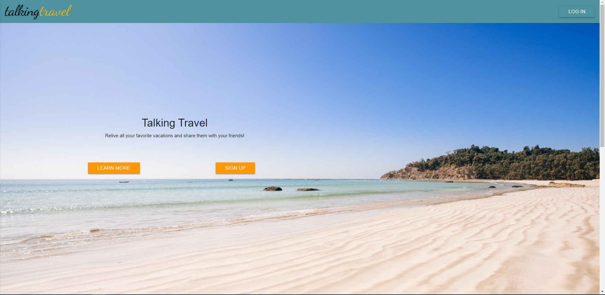

# Talking Travel 
  
  
  
  ### Description

 The project uses an API from MapBox, which is similar to Google Maps but much more customizable. I added in a login page, and created a new location page as well as a view history page of added locations/descriptions. I used Materialize for the design features, Mongo DB for the database, a boiler plate for the routes, React.js components, Express, CSS, NPM Turf (additional styling for Mapbox), and NPM multer (in order to upload photos into Mongo DB).

 I present to you a travel blog materialized in the form of your personal online passport. You can add photos, past trips, and details about a certain restaurant or experience during your trip, and you can share amongst family and friends. I added a map which can show you where your friends or family have visited. Another feature would include trip planning.

  ### User Story

  * AS an avid traveller I WANT to be able to plan ahead to have the best possible trip and I want to share that experience with family and friends. 
  
  ### Table of Contents

  * [Installation](#installation)
  * [Usage](#usage)
  * [Contributors](#contributors)
  * [License](#license)
  * [Repository](#Repository)
  * [Questions](#questions)

  ### Installation

  Installation not necessary. App deployed on Heroku.

  ### Usage

  * Open the App.
  * Users sign up and create a page in order to view the map to plan or to write about an experience
  * Users have the option to share more information or upload a photo
  * Check out the view page in order to witness your list of places.

  ### App Screen Shots

  
 
  
  ### Contributors

  

  ### License

  

  ### Repository

  - [Github](https://github.com/EMackPierre/Talking-Travel)
  - [Heroku](https://agile-taiga-58568.herokuapp.com/)

  ### Questions

  If you have any additional questions you may contact me at https://github.com/EMackPierre

  You may also email me at emmp318@gmail.com